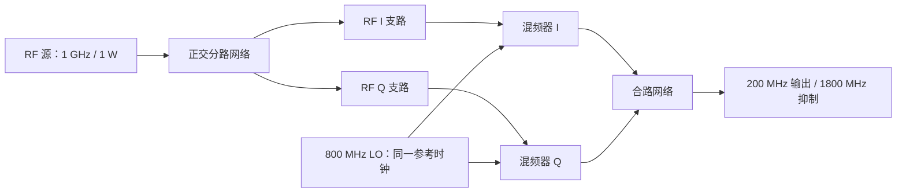

# 相干 RF 系统前馈图文件

`rfmodel.coherent-system` version=1 把源/参考时钟、多输出线性网络、规定 CW LO
的理想混频、共同基波压缩、分阶非线性和后级合路放入一个可保存的分析模型。数值求解、变频和相干合并调用
已有原生库；Python 执行器负责端口调度、文件读取及本次分析的来源身份管理。

## 从文件执行

仓库示例 `examples/coherent-image-rejection.json` 从一个 1 GHz、1 W RF 源出发，
经过幅度各 `1/sqrt(2)` 的正交分路、两个 800 MHz LO 混频器和三端口合路器。
两个 LO 使用同一参考时钟，相位为 0°/90°，RF 两路相位也为 0°/90°。
输出为 200 MHz 差频约 1 W，1800 MHz 和频在浮点舍入范围内相消。
删除 lo-b 的 reference_clock 后，两边带各约 0.5 W。

```powershell
$env:PYTHONPATH = "$PWD/python"
python -m rfmodel examples/coherent-image-rejection.json --library build-msvc/Release/rfmodel_c.dll --output build-reference/coherent-system-result.json
```

Python 入口为
`rfmodel.coherent_system_file.analyze_coherent_system(library, document, base_directory=...)`。
它不会修改传入模型。已有的独立 [Python 示例](../examples/coherent-image-rejection.py)
从两条各 1 W 的 RF 支路开始，因输入归一化不同，其输出功率为这里的两倍。



## 顶层与流

顶层必填 `format/version/spacing_hz/sources/inputs/stages/outputs`；
可选 `reference_ohms`，默认 50。网格间隔和共同实参考阻抗必须有限且为正。

- `sources` 沿用源定义：每项含唯一非空 `id`，可选 `reference_clock`。
  RF 和 LO 一起解析。同一非空时钟名字表示相干；空时钟使不同源彼此独立。
- `inputs` 每项含唯一流 `id` 与 `components`。每个初始分量含
  `source/bin/bandwidth_hz/amplitude`；类型固定 source，分组由源定义产生。
  同一流内相干分量会先合并，仍保留零幅度组。
- `stages` 按拓扑顺序执行，每级拥有唯一阶段 `id` 和 `type`。
  只能引用初始流或先前阶段已经产生的流，不允许前向引用、环或覆盖已有流。
  阶段 ID 和流 ID 分属不同名字空间。
- `outputs` 是所需输出流 ID 的非空、不重复列表。

分量仍采用正频率 bin 与 sqrt(W) 复幅度。复数可使用实数或 `[real, imag]`。
零频、非有限值、非法带宽、未知字段或未声明来源均显式报错。
阶段/流标识区分大小写，非空、无 NUL，最多 1024 UTF-8 字节。

流表示特定参考阻抗下的入射/出射功率波。多次引用同一流会复制该波形，
不会自动作功率分配，也不会把后级反射送回前级。需要真实分路比例和相位时，
应使用多输出线性网络，示例即如此构建。

## 多输出线性网络阶段

```json
{
  "id": "split",
  "type": "linear_network",
  "network": {
    "devices": [{"id": "s", "s": [[0, 0.5, 0.5], [0.5, 0, 0], [0.5, 0, 0]]}],
    "external_ports": [["s", 0], ["s", 1], ["s", 2]]
  },
  "inputs": [{"stream": "incident", "port": ["s", 0]}],
  "outputs": [{"id": "arm-a", "port": ["s", 1]}, {"id": "arm-b", "port": ["s", 2]}]
}
```

network 契约沿用 [相干网络文件](coherent-network-file.md)。支持固定 S、
传输线、RLGC 线、线性放大器与 Touchstone，以及内部连接和反射终端。
inputs 将流接到所选外部端口，outputs 将不同输出端口映射为不同新流。
所有端点必须属于 external_ports，即使输入流为空也会验证。

执行器在输入分量的实际频点上提取完整网络的外部 S 矩阵，然后计算所有
指定输出；多输出不会重复提取完整网络。输入在同一端口内可先相干合并，
不同端口必须经过各自复数传输路径后才能合并。空流仍以 0 Hz 验证网络；
Touchstone 默认禁止越界，必要时可显式采用既有 clamp 策略。

## 混频阶段与持续来源管理

```json
{
  "id": "convert",
  "type": "ideal_mixer_bank",
  "branches": [
    {"id": "if-a", "input": "arm-a", "lo_source": "lo",
     "lo_bin": 8, "conversion_gain_db": 0, "lo_phase_radians": 0}
  ]
}
```

每支路必填输出流 id、输入流 input、lo_source、lo_bin、
conversion_gain_db；lo_phase_radians 可省略，默认 0。LO 源必须在 sources
声明。LO 是规定的无噪声 CW，不是网络求解端口。即使输入流为空，也验证
LO 频率、增益和相位参数。

同一批调用原生 [相干混频](coherent-mixer.md)，为每个输入保留上下边带，
并正确处理负差频折返。执行器维护一个分析内的 `(RF 组, LO 组)` 注册表：
相同来源对在后续混频阶段再次出现时，其局部新组号映射到首次分配的组号。
所有原始源和已生成混频组均被预留，因此直接旁路不会与新混频组身份碰撞。
这允许分开声明的共源混频器在后级正确合路，原生批处理 API 本身未改为有状态。

这种映射保存相干关系；**组号的具体数值不是跨文件或跨执行的稳定标识**。
交换互不依赖阶段不会改变相干判定或输出功率，但不保证数字编号不变。
第二级混频以第一级输出组为 RF 来源，形成新的来源对；没有将不同级数、
不同 LO 顺序或频率代数抵消自动归为同一全局谱系。

每支路的输出流在本支路内合并，然后才能接到后级网络。原生混频的边界仍适用：
两个边带均保留；RF=LO 所产生的 DC 明确拒绝，跨 DC 频带也拒绝；
无 LO 驱动功率、泄漏、转换杂散矩阵、压缩、相位噪声或变频噪声。

## 输出与限额

结果格式为 `rfmodel.coherent-system-result` version=1。sources 给出来源分组；
stages 列出每级产生的流；outputs 保留所需输出列表；streams 保存所有初始和
中间流，包含组件、分频点功率与总功率，便于定位相消发生在哪一级。
中间流功率不能彼此相加作为系统总功率，因为它们可能是同一信号的传播快照。

限额：4096 个来源，4096 个流，512 个阶段；单流最多 4096 个归并分量，
全部保存流合计最多 65536 个分量。单线性阶段最多 4096 个入射分量、
1024 个不同输出端口、2048 个频点；入射分量数乘输出端口数不超过 65536。
单混频阶段最多 2048 条支路且累计 RF 输入分量不超过 2048。超限报错，
不截断谱线。

相对 Touchstone 路径以模型文件目录解析。命令行保护所有线性阶段的数据文件，
禁止结果覆盖模型、共享库或 Touchstone 输入；分析失败时保持已有输出文件内容。
JSON 严格加载和输出机制沿用既有 CLI。

## 共同基波压缩阶段

新增 fundamental_compression：单输入流、多来源共同驱动，source 类型限定，
保留相干身份与相位。字段、曲线及完整示例见 [相干压缩接口](coherent-compression.md)。
结果阶段包含 input_power_w；谐波、互调和噪声不会由此节点生成。

## 验证与剩余范围

回归覆盖单源正交分路、锁定/独立 LO、独立 RF、跨混频阶段来源复用、
独立阶段换序、两级变频、旁路身份隔离、生成频点上的频变延迟与 Touchstone
插值、多输出共享网络提取、空流参数验证、非法拓扑和文件保护。

本格式是匹配阶段边界的**前馈 RF 图**，线性子网络内部可包含反馈。
它没有跨阶段双向负载迭代、递归多级非线性来源、谱密度/带宽重叠积分、DC 相干图、
噪声图、参数优化或完整 SystemVue RF System Analysis 路径/预算语义。
上述结果为解析与接口回归，没有新增 SystemVue Mixer 实测，不能据此宣称
SystemVue RF Design Mixer 或完整系统分析兼容。


最初的网络/混频阶段 MSVC Debug/Release 各 66/66 回归通过；独立 wheel 的 Python API
60 项、原有相干网络文件 9 项、系统图文件 10 项通过。示例数值和容差见
[解析验证记录](../validation/coherent-system-analytic.json)。记录属于本机解析
验证，远端 CI 以对应提交运行结果为准。

共同基波压缩扩展的当前验证为 Debug/Release 各 67/67，安装消费者各 2/2，
wheel API 61 项、系统图 13 项；新增链路的解析结果见
[压缩接收链验证](../validation/coherent-compression-analytic.json)。

## 同频多源分阶非线性阶段

新增 limited_amplifier，输出带来源身份的直接、二阶和三阶 RF 项。
图内并行放大器按完整输入来源式复用组号，支持生成项后级传播和相干合路。
字段、输入限制、206 项单放大器 SystemVue 对照与解析合路示例见
[同频多源放大器](coherent-amplifier.md)。递归多级非线性仍未完成。

[失真来源级联](coherent-amplifier-cascade.md) 新增 cascaded_amplifier：传播前级谐波/互调，计入共同驱动，并与本级同源失真相干合并。八组 SystemVue 对照中六组通过，两组 0 dB 增益差异保留；次级失真再混频仍未完成。

[递归来源与多项式系统图](recursive-mixing-origins.md) 新增原始源因子展开、同源失真归并及显式全局来源阶数限制。混频多来源传播已在后续阶段接入；SystemVue 高阶子谱语义仍待完成。

[混频与多项式的多来源系统图](mixed-polynomial-graphs.md) 支持混频折叠后的复波贡献经线性网络继续非线性展开；独立数值对照通过，共同压缩已由[公共工作点](common-amplifier-response.md)接入，SystemVue 全局阶数/高阶系数仍待验收。
